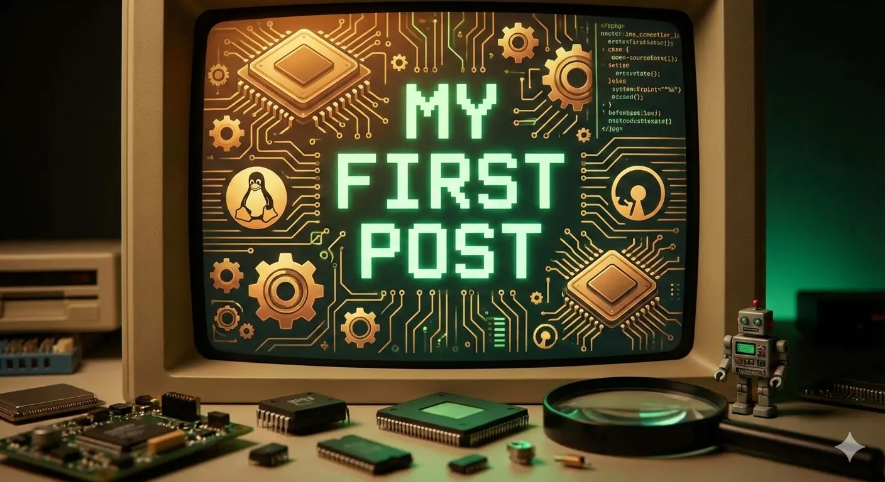

# My First Post

Hope everyone is doing well.

This is not actually my first blog post — it’s my **first website**.

I’ve always been more comfortable working close to the kernel than working on design.  
UI, colors, layouts… not really my thing. Kernel internals, on the other hand, *that’s home*.

This site marks a **new beginning** for me:

- New goals 🎯
- New challenges 🧗🏻‍♂️
- New passion ✅
- New profession 🧑🏻‍💻
- New skills 🚀

I’ve decided to follow a new direction with clear intentions — not for the sake of others, but for **myself and my family**.

This blog will stay simple and technical.

I won’t be sharing much personal information here, but I will be sharing things I find interesting — especially around Linux, kernel internals, security, and low-level systems.

More posts coming soon.
